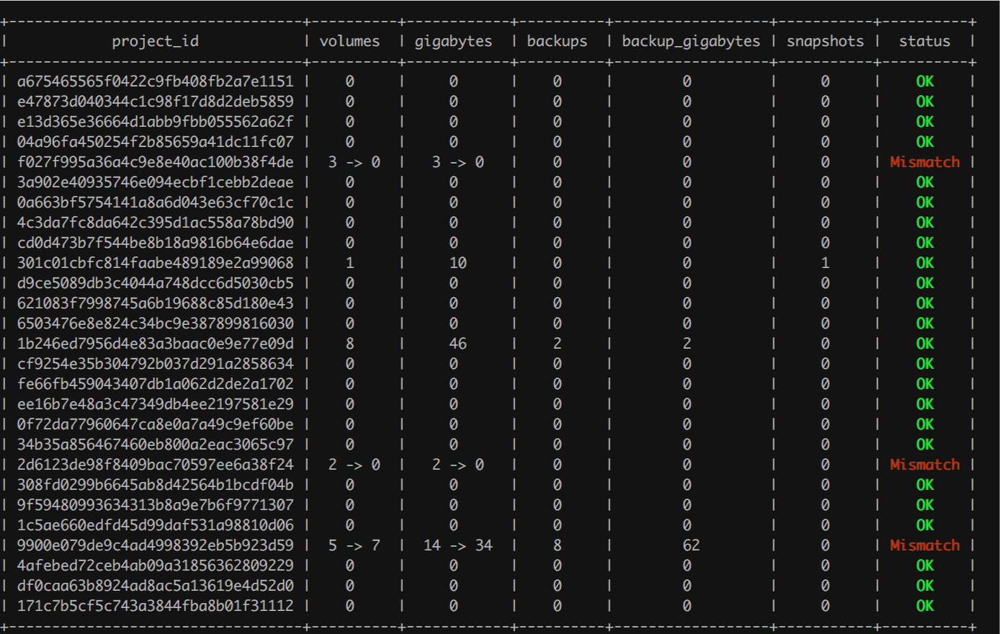
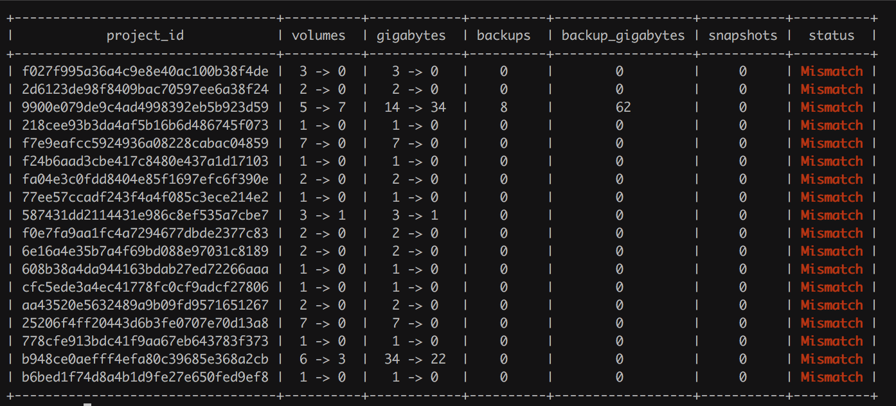
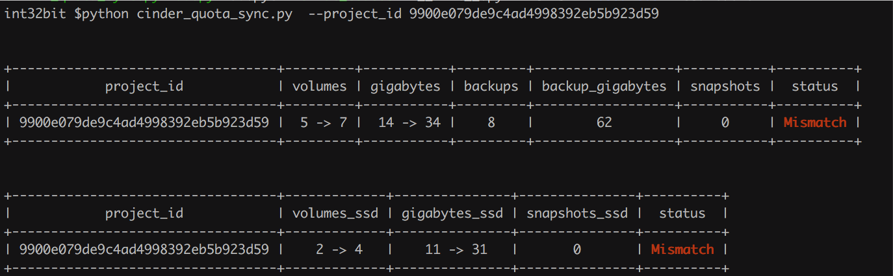

# Cinder Quota Sync

## What is it?

This project is inspired on project [nova-quota-sync](https://github.com/cernops/nova-quota-sync).

It's a small script that compares cinder quota usage information with
the actual usage per resource (tenant).

It also provides an easy way to synchronize quotas in case of mismatch.


## How to use it?

To see the available options run:

```
➜ phthon cinder_quota_sync.py -h
usage: cinder_quota_sync.py [-h] [--all] [--auto_sync]
                            [--project_id PROJECT_ID] [--config CONFIG]

optional arguments:
  -h, --help            show this help message and exit
  --all                 show the state of all quota resources
  --auto_sync           automatically sync all resources, PLEASE USE IT WITH
                        EXTREME CAUTION.
  --project_id PROJECT_ID
                        searches only project ID
  --config CONFIG       configuration file
```

If `--auto_sync` are not used it will only display quotas in case of mismatch.

**Since it updates cinder DB, use it with extreme caution.**

## Examples

```sh
python cinder_quota_sync.py --config my_nova.conf --all
```



```sh
python cinder_quota_sync.py --config my_nova.conf
```



```sh
python cinder_quota_sync.py --auto_sync
```

This will write data to DB.

```sh
python cinder_quota_sync.py --project_id "d945d5ce-cfb8-11e4-b9d6-1681e6b88ec1"
```




## Cinder versions supported

We use it in Mitaka, it may work well in higher version.


Bugs and Disclaimer
-------------------
Bugs? Oh, almost certainly.

This tool was inspired on project [nova-quota-sync](https://github.com/cernops/nova-quota-sync) and written to be used in our private cloud and
it has been tested only in our environment.

Since it updates cinder DB use it with extreme caution.
